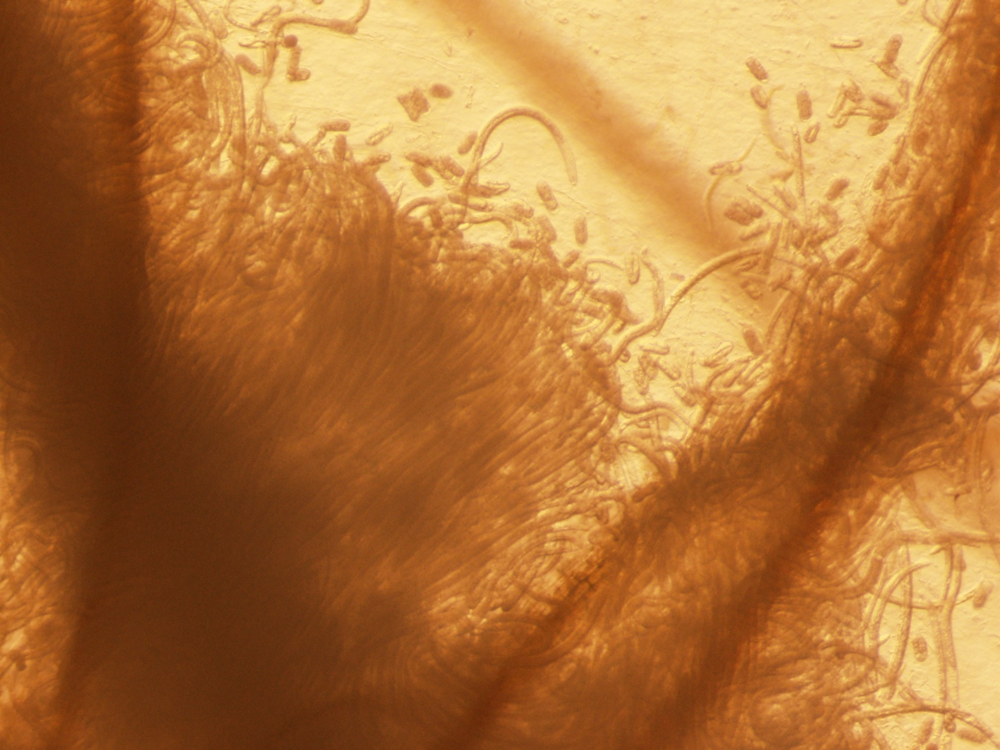
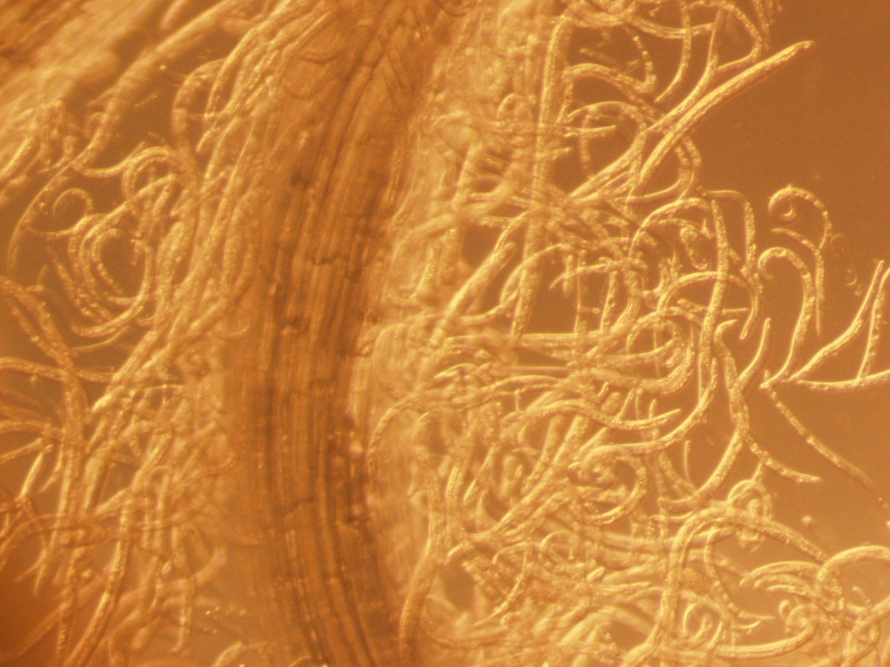
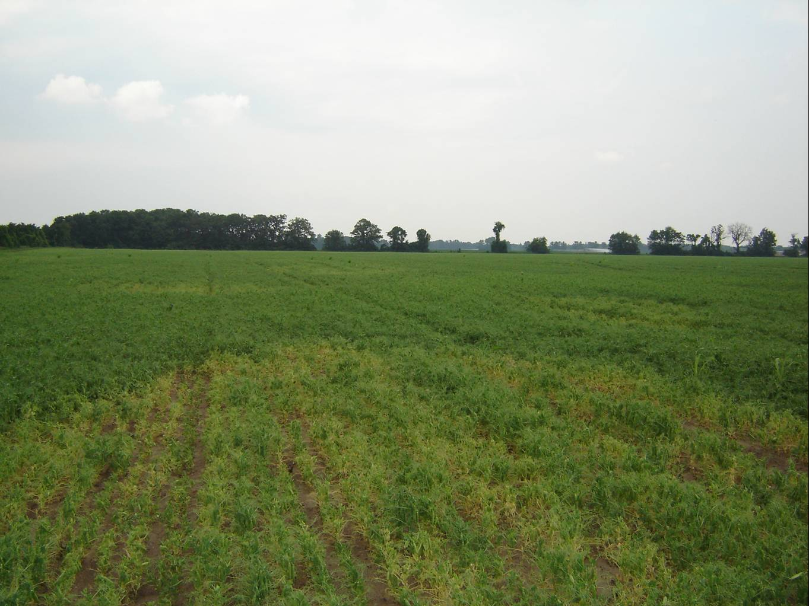

## Stitching imaging 

Stitching imaging allows to "stitch" multiple images at high resolution. 

## Aggregative behaviour of *Pratylenchus* spp. 

I find their aggregative behaviour very fascinating. 
*Pratylenchus* spp. can be easily grown on a tissue culture, so that allows us to observe their behaviour easier than *in vivo*.

## Yellowing by *Pratylenchus penetrans* on pea in Wisconsin
Photocredit. Dr. Ann E. MacGuidwin

*Pratylenchus* spp. is the third most economically important neamtode pathogen, and yet their damage potential is not well studied for many crops. This picture clealy indicates the impact of the neamtode on crop health!

