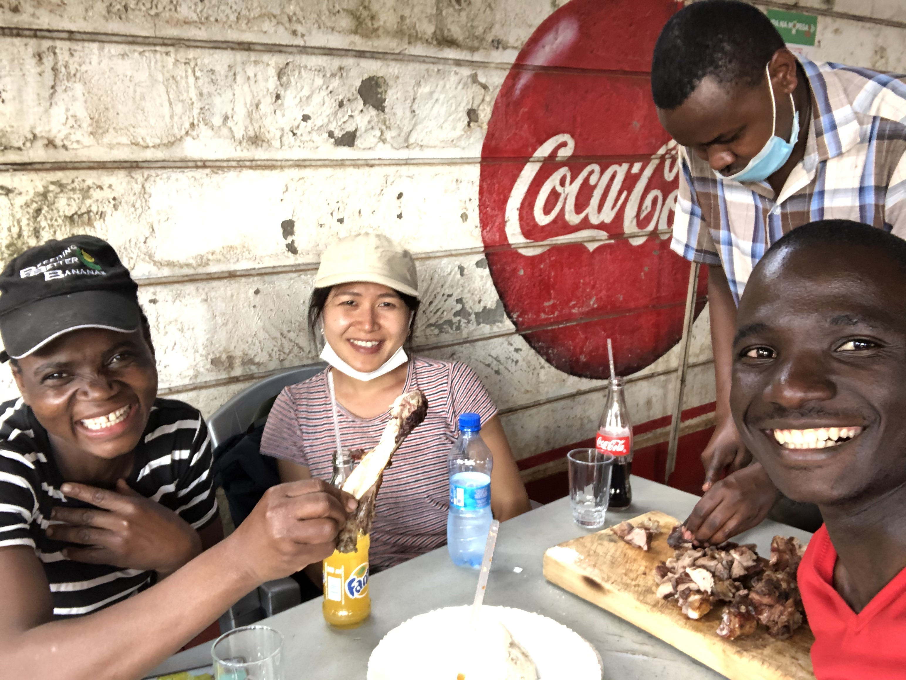
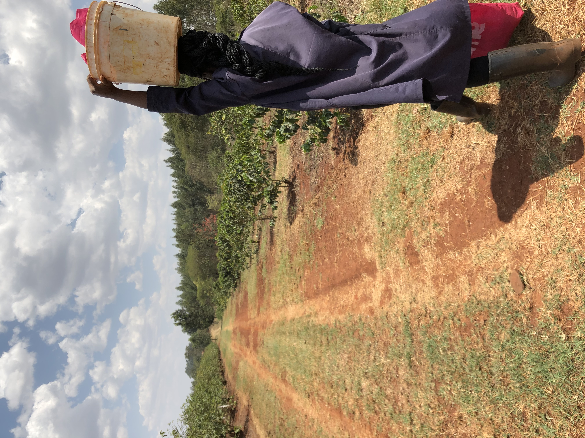
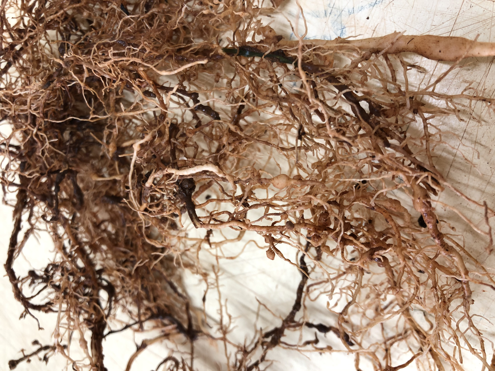
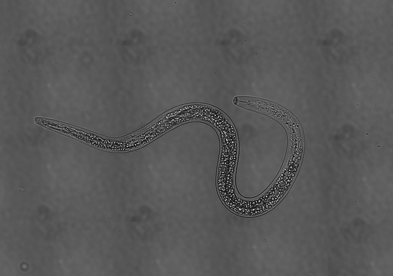
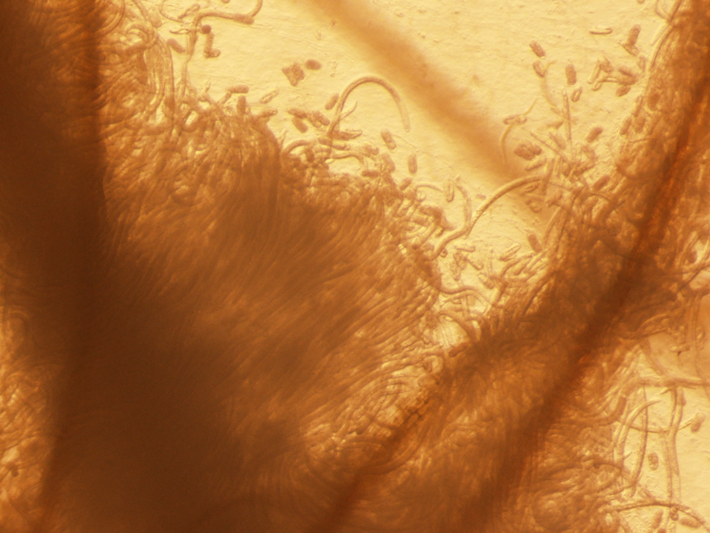
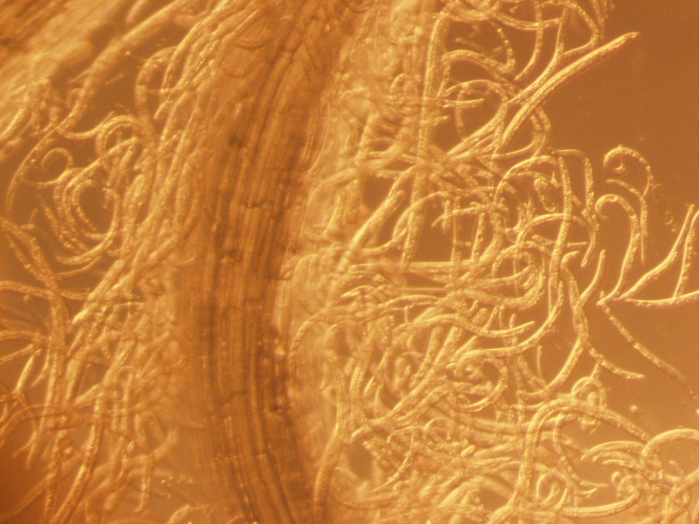
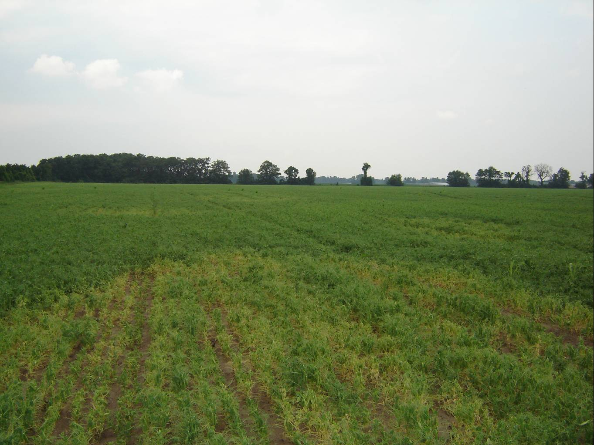

## NemAfrica!
NemAfrica is the joint nematology research unit between IITA and ICIPE in Nairobi, Kenya.
We work on nematode problems in SSA and improve crop health to contribute for better livelihoods of smallholders.

As I lead the coffee nematode project, I introduce my team and our activities on coffee here but if you want to know more about our other research activities please follow us on Twitter @NemAfrica 

*Meloiodgyne* spp on coffee is much neglected here in Kenya but they are surely contribute for the recent nationwide decline in coffee yields.

## Stitching imaging 

Stitching imaging allows to "stitch" multiple images at high resolution. 

## Aggregative behaviour of *Pratylenchus* spp. 

I find their aggregative behaviour very fascinating. 
*Pratylenchus* spp. can be easily grown on a tissue culture, so that allows us to observe their behaviour easier than *in vivo*.

## Yellowing by *Pratylenchus penetrans* on pea in Wisconsin
Photocredit. Dr. Ann E. MacGuidwin

*Pratylenchus* spp. is the third most economically important neamtode pathogen, and yet their damage potential is not well studied for many crops. This picture clealy indicates the impact of the neamtode on crop health!

