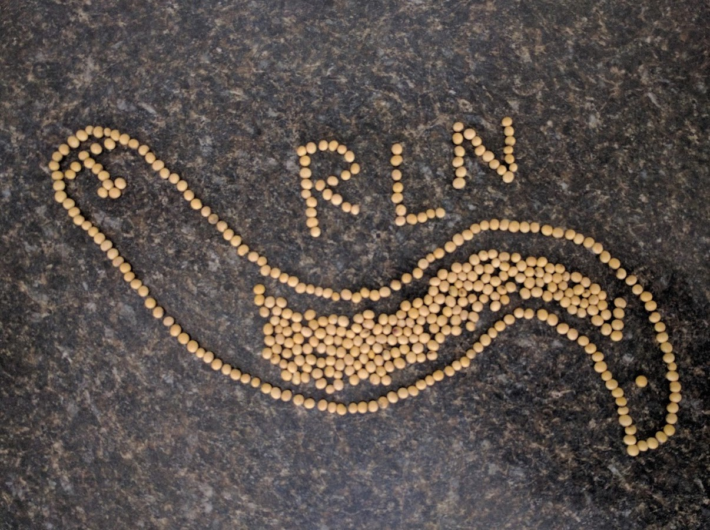

I like to post beautiful neamtode pictures I have taken.
Hope you will love them!

## SOYBEAN RLN!!

## Stiching image of *Pratylenchus fallax* 

I love nematode stiching images.

## Yellowing by *Pratylenchus penetrans* on pea in Wisconsin
Photocredit. Dr. Ann E. MacGuidwin

*Pratylenchus* spp. is the third most economically important neamtode pathogen, and yet their damage potential is not well studied for many crops. This picture clealy indicates the impact of the neamtode on crop health!

## Aggregation of *Pratylenchus* spp. behaviour

I am always fascinated by their aggregative behaviour. They are so simple and yet very sophisticated animals. 
They look like nematode spaghetti. 

## Lab picture - UF
This is not really a nematode photo, but this is a picture of me with other lab members in UF at a home party.
The most left asian girl in the picture is me, and the only man in the picture is my M.S. advisor, Dr. Dickson.
There is my favorite nematologist in the world, Dr. Janete in the picture as well (a lady with lovely curly hair)!

