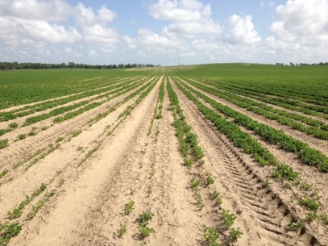
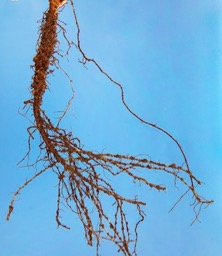
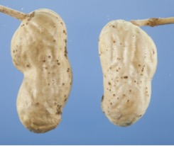
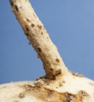

## Investigation of *Belonolaumus longicaudatus* on peanut in Florida
([Kutsuwa et al. 2015.](../Kutsuwa_et_al_2015_BelonolaimusOnPeanut.pdf))

This was my M.S. project at the University of Florida, adviced by Dr. Dickson.
Sting nematode, *Belonolaimus longicaudatus* is the most damaging nematode pest on turfgrass. We found this neamtode on peanut for the first time in Florida.

Sting neamtode induce yellowing and stunting. This is especially prominent at early maturity stages of peanuts.

The infected roots are abbreviated, which makes impossible for plants to take up nutrients and water, thus the aboveground shows nutrient deficiency like symptoms.

The nematode also feed on pods and pegs. You can see their feeding sites as punctuated dark circles on pods and pegs.

## Ph.D. projects
Once the manuscripts are accepted, I will post descriptions of my Ph.D. projects with publications here...
